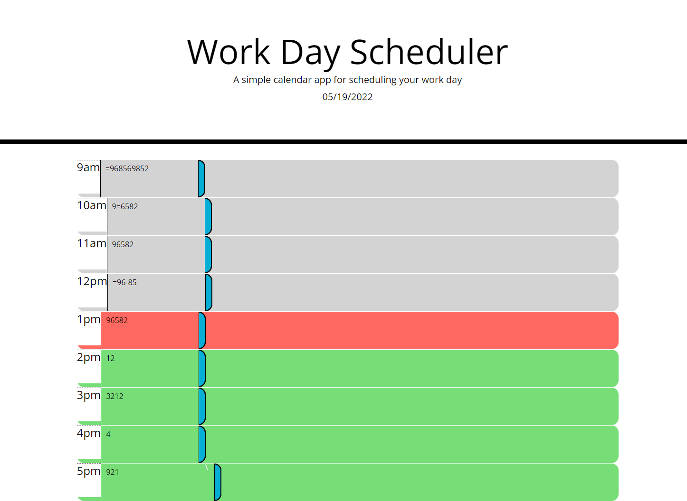

# DESCRIPTION:

A webpaget that allows the user to type in plans per business hour. The site saves the information to local storage and loads the saved information upon refresh.

# SCREENSHOT:

# LINK TO APPLICATION: 

https://github.com/Seeker-09/Work-Day-Scheduler
